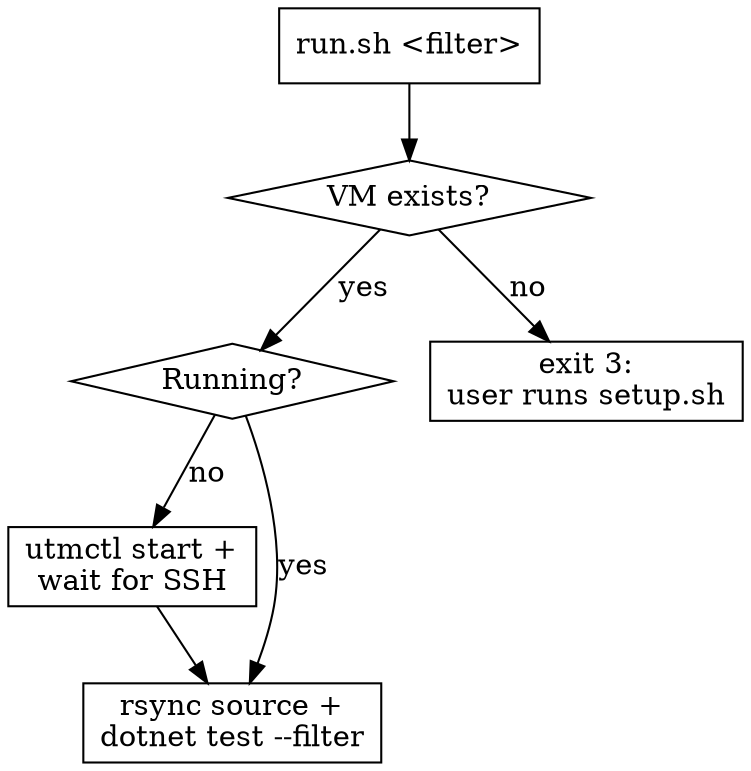

# Run Windows-only tests via a local UTM VM

## Overview

Windows-only tests (`[WindowsTest]`) compile on macOS but **skip at runtime** — they
need a real Windows host (they spawn `cmd.exe`, `ping.exe`, query WMI). This skill runs
them on a local UTM Windows 11 ARM VM and returns results synchronously. SSH is forwarded
to loopback (`127.0.0.1:2222`), which is reachable from the sandbox, so this loop is
fully drivable here — no CI poll, no handing back to the user.

## When to use

- A test is `[WindowsTest]` / shows as skipped locally and you need its real result.
- You're iterating on Windows process/abandonment behavior in `SilentProcessRunner`.
- NOT for tests that run on macOS — just run those with `dotnet test` directly.

## First-time setup

If the VM doesn't exist yet, the one-time build is itself a script:

```bash
.claude/skills/run-windows-tests/setup.sh
```

It installs UTM, fetches the ISO, serves `provision.ps1` to the guest, configures the SSH
port forward, and verifies the toolchain. It pauses only at the two steps UTM has no CLI
for (creating the VM, running the Windows installer). **Don't run it unattended yourself**
— those GUI pauses need the user. On exit code 3 below, tell the user to run it.

## How to run

One entry point handles all VM states. Run it from the repo root:

```bash
.claude/skills/run-windows-tests/run.sh "<nunit-filter>"
# e.g.
.claude/skills/run-windows-tests/run.sh "Name~CancelThenAbandon_WhenGrandchild"
```

`run.sh` resolves VM state via `utmctl` and acts:



**On exit code 3** (VM not created): tell the user to run `setup.sh` once. Do not run it
yourself — it has GUI pauses (VM creation, Windows installer) only the user can complete.

**On exit code 4** (VM started but SSH never came up): the VM is booting or the port
forward is missing — have the user re-run `setup.sh`, which checks and fixes both.

Any other non-zero exit is the `dotnet test` result — report it as the test outcome.

## Configuration

`run.sh` reads these env vars (defaults in parentheses):

| Var | Default | Meaning |
|-----|---------|---------|
| `OCTO_WIN_VM` | `octopus-win` | UTM VM name |
| `OCTO_WIN_SSH_HOST` | `127.0.0.1` | forwarded host (loopback) |
| `OCTO_WIN_SSH_PORT` | `2222` | forwarded SSH port |
| `OCTO_WIN_SSH_USER` | `dev` | guest user |
| `OCTO_WIN_GUEST_REPO` | `C:/repo` | build dir in the guest |
| `OCTO_WIN_TEST_PROJECT` | `source/Octopus.Tentacle.Tests.Integration` | project to test |

## Why these choices

- **rsync source only** (`bin/`, `obj/`, `.git/` excluded): the VM keeps its own build
  cache and NuGet packages, so the first build is slow but iteration is fast. Never copy
  macOS build artifacts into Windows — different RIDs and `obj` caches corrupt the build.
- **Build on the VM, not the Mac**: the test only executes on Windows anyway, and
  cross-OS build outputs are a bug farm.
- **No UTM shared folder**: UTM↔Windows sharing is WebDAV-only and flaky — bad for builds.

## Common mistakes

- Running `dotnet test` on the Mac and reporting "passed" — it **skipped**. Check for
  `[WindowsTest]` and use this skill.
- Editing in the guest. Edit on the Mac; `run.sh` syncs every run.
- Creating the VM automatically. The Windows install is interactive — have the user run `setup.sh`.
