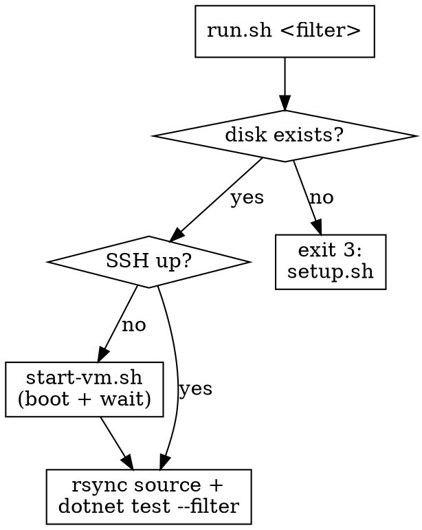

# Run Windows-only tests via a local QEMU VM

## Overview

Windows-only tests (`[WindowsTest]`) compile on macOS but **skip at runtime** — they need
a real Windows host (they spawn `cmd.exe`, `ping.exe`, query WMI). This skill runs them on
a local **headless QEMU Windows 11 ARM** VM and returns results synchronously. SSH is
forwarded to loopback (`127.0.0.1:2222` via QEMU `hostfwd`), which the sandbox can reach,
so the whole loop is drivable here — no CI poll, no handing back to the user.

QEMU is used directly (not UTM) precisely so VM creation + install are scriptable: UTM only
exposes start/stop and hides creation behind a GUI.

## When to use

- A test is `[WindowsTest]` / shows as skipped locally and you need its real result.
- You're iterating on Windows process/abandonment behavior in `SilentProcessRunner`.
- NOT for tests that run on macOS — just run those with `dotnet test` directly.

## Files

| File | Role |
|------|------|
| `lib.sh` | shared config + helpers (paths, QEMU args, SSH waits) |
| `fetch-iso.sh` | build the Windows 11 ARM64 ISO via UUP dump (from MS update servers) |
| `setup.sh` | one-time: firmware, disk, TPM, ISOs, unattended install, provisioning |
| `autounattend.xml` | hands-free Windows install + first-logon provisioning hook |
| `provision.ps1` | in-guest: virtio-net driver, OpenSSH + key, .NET 8 SDK, rsync |
| `start-vm.sh` | boot the installed VM headless, wait for SSH (idempotent) |
| `run.sh` | per-run: ensure VM up, rsync source, `dotnet test --filter` |

## How to run

```bash
.claude/skills/run-windows-tests/run.sh "Name~CancelThenAbandon_WhenGrandchild"
```



**On exit 3** (VM not built): run `setup.sh`. It's fully self-contained — if no ISO is in
`$OCTO_WIN_ISO_DIR` (default `~/UTM-ISOs`) it builds one via `fetch-iso.sh` (UUP dump,
~5 GB) — then does the ~20–40 min unattended install. Clickless; fine to run yourself.

**On exit 4** (booted but no SSH): check `C:\provision.log` in the VM (run `setup.sh` with
`-display cocoa` in `lib.sh` to watch). Provisioning may have failed.

Any other non-zero exit is the `dotnet test` result — report it as the test outcome.

## Configuration

All overridable via env (see `lib.sh` for the full list):

| Var | Default | Meaning |
|-----|---------|---------|
| `OCTO_WIN_ISO_DIR` | `~/UTM-ISOs` | where the Windows ARM64 ISO lives |
| `OCTO_WIN_SSH_PORT` | `2222` | loopback SSH port (QEMU hostfwd) |
| `OCTO_WIN_SSH_USER` | `dev` | guest user |
| `OCTO_WIN_GUEST_REPO` | `C:/repo` | build dir in the guest |
| `OCTO_WIN_RSYNC_DEST` | `/cygdrive/c/repo` | rsync dest (cwRsync is cygwin-style) |
| `OCTO_WIN_TEST_PROJECT` | `source/Octopus.Tentacle.Tests.Integration` | project to test |

## Why these choices

- **QEMU, not UTM/Virtualization.framework**: QEMU is the only fully-CLI path (creation +
  unattended install), and its `hostfwd` gives the loopback SSH the sandbox needs in one
  flag. vz is faster but fights us on Windows maturity and inbound networking.
- **rsync source only** (`bin/`, `obj/`, `.git/` excluded): the VM keeps its own build
  cache, so iteration is fast. Never copy macOS build artifacts into Windows — different
  RIDs and `obj` caches corrupt the build.
- **Build on the VM, not the Mac**: the test only executes on Windows anyway.

## Common mistakes

- Running `dotnet test` on the Mac and reporting "passed" — it **skipped**. Use this skill.
- Editing in the guest. Edit on the Mac; `run.sh` syncs every run.
- Reporting setup "done" unverified — `setup.sh`/`provision.ps1` are first-run-validate.
