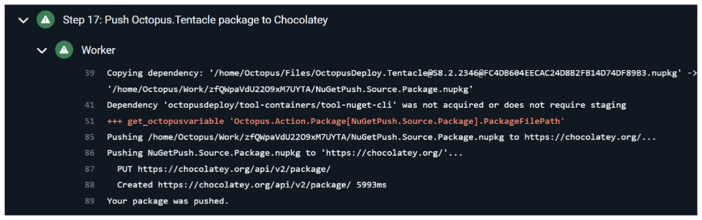

# Tentacle Rollout

When you create a change through a PR in Tentacle, a whole lot of processes spring into action. This document tries to outline all the steps that happen.

## 1. TeamCity Build

As mentioned in the [Readme](https://github.com/OctopusDeploy/OctopusTentacle/blob/main/README.md), when you create a PR, a TeamCity build process kicks off.

Teamcity pushes all the artifacts generated by the build process into Artifactory. These artifacts include installers for the various platforms Tentacle can be installed on.

## 2. Artifactory

[Artifactory](https://packages.octopushq.com/ui/repos/tree/General/chocolatey) holds the nuget packages for every build of Tentacle. You'll notice that for every build, Tentacle has two nupkg versions - one for the self-contained Tentacle which can run without the .NET Framework and one for the .NET Framework version.

## 3. Octopus Deploy

After the Teamcity build pushes to our non-public storage systems for Tentacle, the Octopus Deploy [process](https://deploy.octopus.app/app#/Spaces-1/projects/octopus-tentacle/deployments?groupBy=Channel) then takes over and starts to deploy to public-facing locations.

### Slipway and the Downloads Page

During the deployment, Octopus calls the Slipway API to create a Tentacle release in Slipway.

This in turn allows the Tentacle to become visible on Slipway

and on the [Downloads](https://octopus.com/downloads/tentacle) page.

### Chocolatey

Octopus also calls Chocolatey ([self-contained version](https://community.chocolatey.org/packages/OctopusDeploy.Tentacle.SelfContained)/[.NET Framework version](https://community.chocolatey.org/packages/OctopusDeploy.Tentacle)) to make Tentacle available as a Chocolatey Community package.

#### Side-note - How the Chocolatey installer works:

When a user runs `choco install octopusdeploy.tentacle.selfcontained`, it actually runs the chocolateyInstall.ps1 script. During the packaging process, the urls are replaced by the correct version numbers.
